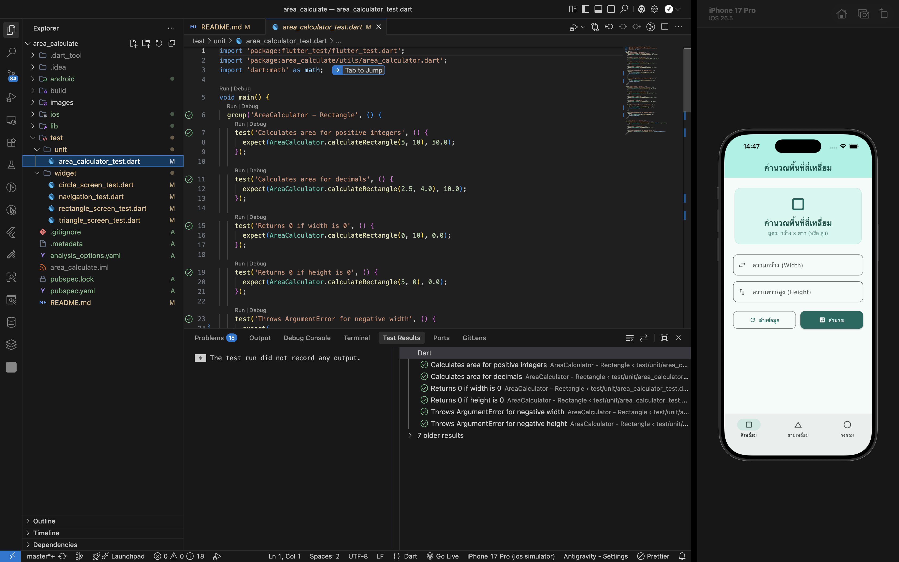
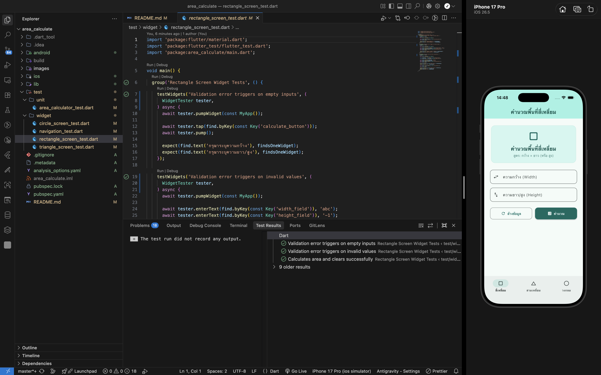
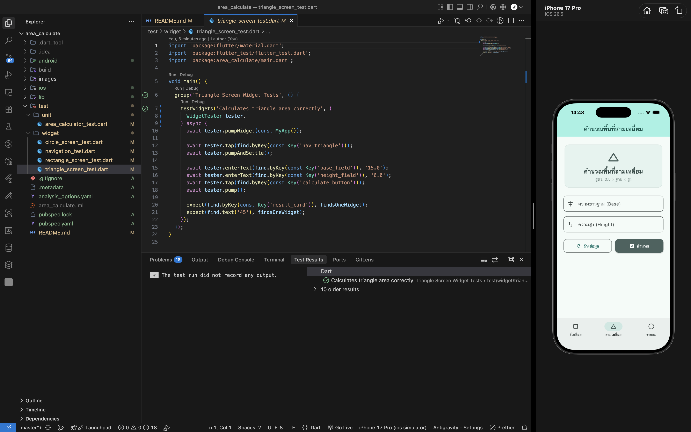
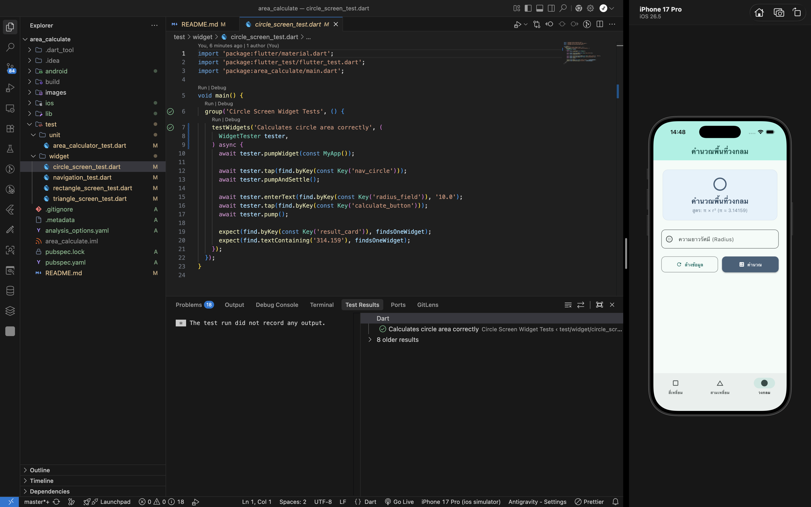

### Name: ณัฐพล สุตา

### Student ID: 671103002

---

# ระบบคำนวณพื้นที่รูปทรงเรขาคณิต (Area Calculate App)

แอปพลิเคชันมือถือพัฒนาด้วย Flutter สำหรับคำนวณพื้นที่ของรูปทรงเรขาคณิต 3 รูปแบบ ได้แก่ สี่เหลี่ยม สามเหลี่ยม และวงกลม โดยมีโครงสร้างส่วนต่อประสานผู้ใช้ที่แบ่งตามหมวดหมู่โดยใช้ BottomNavigationBar

---

## ความแตกต่างระหว่าง Unit Test และ Widget Test

การทดสอบในโปรเจกต์นี้ถูกแบ่งออกเป็น 2 ประเภทหลัก เพื่อรับประกันความถูกต้องของทั้งฟังก์ชันการทำงานภายในและหน้าจอแสดงผลภายนอก:

| หัวข้อเปรียบเทียบ    | Unit Test (การทดสอบหน่วย)                                                  | Widget Test (การทดสอบส่วนประกอบ UI)                                     |
| :------------------- | :------------------------------------------------------------------------- | :---------------------------------------------------------------------- |
| **ขอบเขตการทดสอบ**   | เน้นทดสอบตรรกะทางคณิตศาสตร์และคำนวณ (Business Logic) ในระดับฟังก์ชันเดี่ยว | เน้นทดสอบการสร้างองค์ประกอบบนหน้าจอ (Widget tree) และการโต้ตอบของผู้ใช้ |
| **สภาพแวดล้อม**      | ทำงานบนหน่วยความจำธรรมดา ไม่ต้องอาศัยการวาดหน้าจอหรือสร้าง UI              | จำลองโครงสร้างส่วนประกอบของหน้าจอขึ้นมาในหน่วยความจำสำหรับการทดสอบ      |
| **สิ่งที่ใช้ทดสอบ**  | ฟังก์ชันการคำนวณในคลาส AreaCalculator                                      | หน้าจอแอปพลิเคชันและการสลับแท็บเมนูด้วย BottomNavigationBar             |
| **ความเร็วในการรัน** | ทำงานได้รวดเร็วที่สุดในระดับมิลลิวินาที                                    | ใช้เวลาปานกลางเนื่องจากต้องจัดเตรียมโครงสร้างของ Widget                 |

---

## ผลการทดสอบระบบ (Test Results)

ผลลัพธ์จากการรันชุดทดสอบทั้งหมด 21 รายการผ่านการตรวจสอบอย่างถูกต้อง (All tests passed) โดยแบ่งเป็นผลการทดสอบแต่ละส่วนดังนี้:

### 1. ผลการทดสอบผ่าน Terminal

แสดงผลลัพธ์การรันชุดคำสั่งทดสอบทั้งหมด:

### 2. ผลการทดสอบหน้าจอสี่เหลี่ยม

ภาพการทดสอบหน้าจอคำนวณพื้นที่สี่เหลี่ยมและการตรวจสอบความถูกต้องของข้อมูลนำเข้า (Validation Error):

### 3. ผลการทดสอบหน้าจอสามเหลี่ยม

ภาพการทดสอบหน้าจอคำนวณพื้นที่สามเหลี่ยมและผลลัพธ์การคำนวณ:

### 4. ผลการทดสอบหน้าจอนิตยสาร/วงกลม

ภาพการทดสอบหน้าจอคำนวณพื้นที่วงกลมและผลลัพธ์การคำนวณ:

