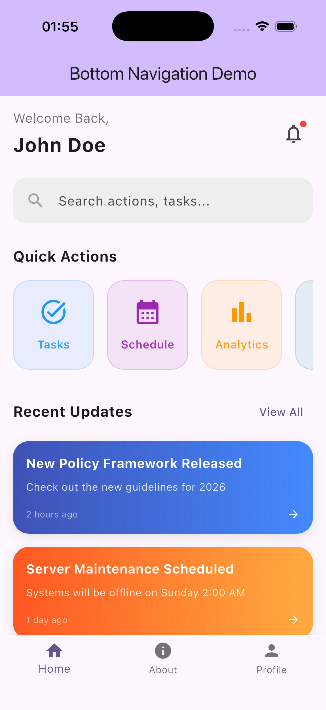
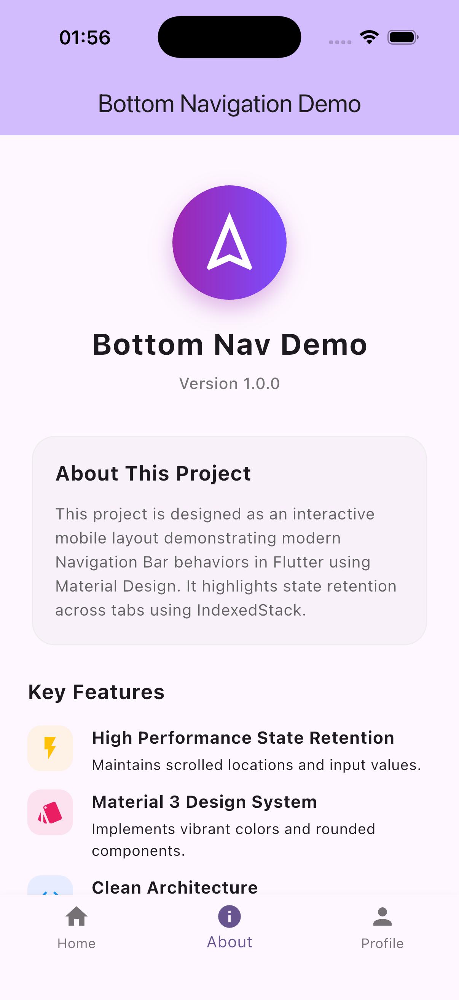
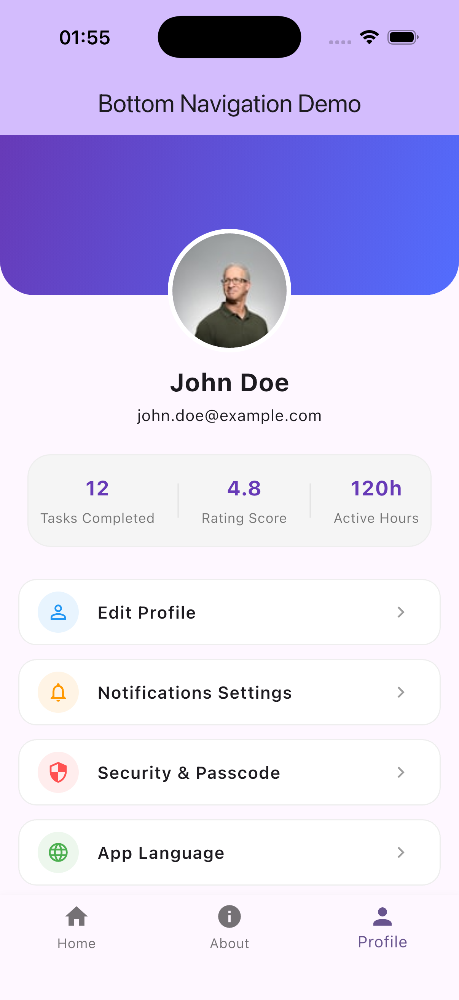

# Workshop: การสร้าง Bottom Navigation Bar

โปรเจกต์นี้เป็นส่วนหนึ่งของวิชาการพัฒนาโปรแกรมประยุกต์บนอุปกรณ์เคลื่อนที่ (Mobile Application Development) หลักสูตรวิศวกรรมซอฟต์แวร์ (Software Engineering)

---

## 1. แนวคิดและองค์ประกอบ (Concepts & Theory)

### 1.1 BottomNavigationBar และ BottomNavigationBarItem

- **BottomNavigationBar**: เป็น Widget แถบนำทางที่อยู่ด้านล่างสุดของหน้าจอ (มักอยู่ภายในโครงสร้าง `Scaffold`) ใช้สำหรับนำทางและสลับหน้าจอหลักของแอปพลิเคชันอย่างรวดเร็ว (มักมี 2-5 แท็บ) โดยทั่วไปจะทำงานร่วมกับ `StatefulWidget` เพื่อจัดการอัปเดตและเก็บค่าแท็บที่เลือก (`_selectedIndex`) และใช้แสดงหน้าจอคู่กับ `IndexedStack`
- **BottomNavigationBarItem**: คือรายการแท็บย่อยแต่อันใน `BottomNavigationBar` ประกอบด้วยองค์ประกอบหลักคือ:
  - `icon`: ไอคอนที่แสดงบนแท็บ (เช่น `Icon(Icons.home)`)
  - `label`: ข้อความคำอธิบาย (Caption) ที่จะแสดงใต้ไอคอน (เช่น `'Home'`)

### 1.2 การสลับหน้าจอด้วย IndexedStack

- **IndexedStack**: เป็น Widget ที่ใช้แสดงผลเฉพาะ Widget ลูกตัวเดียว ณ เวลาใดเวลาหนึ่งตาม index ที่ระบุ โดยยังคงรักษาสถานะ (State) ของ Widget ลูกตัวอื่นๆ ทั้งหมดเอาไว้ (เช่น ตำแหน่งการเลื่อนหน้าจอ, ข้อมูลในฟอร์ม)
- **การทำงานในการสลับหน้าจอโดยคงสถานะ**: แตกต่างจากวิธีนำทางทั่วไปที่จะทำลายหน้าเก่าและสร้างหน้าใหม่ขึ้นมาใหม่ทุกครั้ง `IndexedStack` จะทำการโหลดและสร้าง Widget ลูกทุกตัวตั้งแต่เริ่มต้นและเก็บรักษาสถานะของ Widget ลูกทุกตัวไว้ในหน่วยความจำ เมื่อเปลี่ยนค่า index ตัว `IndexedStack` จะสลับการแสดงผลหน้าจอนั้นทันทีโดยหน้าจอจะอยู่ในสถานะเดิม ทำให้มีประสิทธิภาพสูงและสร้างประสบการณ์ใช้งานที่ดีแก่ผู้ใช้

---

## 2. ขั้นตอนการสร้างและใช้งาน Bottom Navigation Bar

1. **ออกแบบหน้าจอของแต่ละแท็บ**: แยกหน้าจอแต่ละหน้าเป็นไฟล์ Dart อิสระเพื่อความสะอาดและจัดการโค้ดได้ง่าย
2. **สร้าง State สำหรับการสลับหน้าจอ**: ใน `MyHomePageState` มีการกำหนดตัวแปร `_selectedIndex` สำหรับระบุหน้าปัจจุบัน และรายการของหน้าจอ `_pages`
3. **จัดเก็บหน้าจอด้วย IndexedStack**: กำหนด `body` ของ `Scaffold` ให้เป็น `IndexedStack` โดยเชื่อมโยง `_selectedIndex` กับพารามิเตอร์ `index` และนำ `_pages` ไปใส่ใน `children`
4. **ติดตั้ง BottomNavigationBar**: เพิ่ม `BottomNavigationBar` ในส่วนของ `bottomNavigationBar` ของ `Scaffold` กำหนด `currentIndex` ให้ผูกกับ `_selectedIndex` และเมื่อมีการกดเลือกแท็บ (`onTap`) จะเรียก `setState` ปรับเปลี่ยนค่า `_selectedIndex` ตามความเหมาะสม

---

## 3. ผลลัพธ์การทำงาน (Screenshots)

รูปภาพผลลัพธ์การทำงานของแอปพลิเคชันบนเครื่องจำลอง (iOS Simulator) ในแต่ละแท็บ:

|        แท็บ Home         |         แท็บ About         |          แท็บ Profile          |
| :----------------------: | :------------------------: | :----------------------------: |
|  |  |  |
