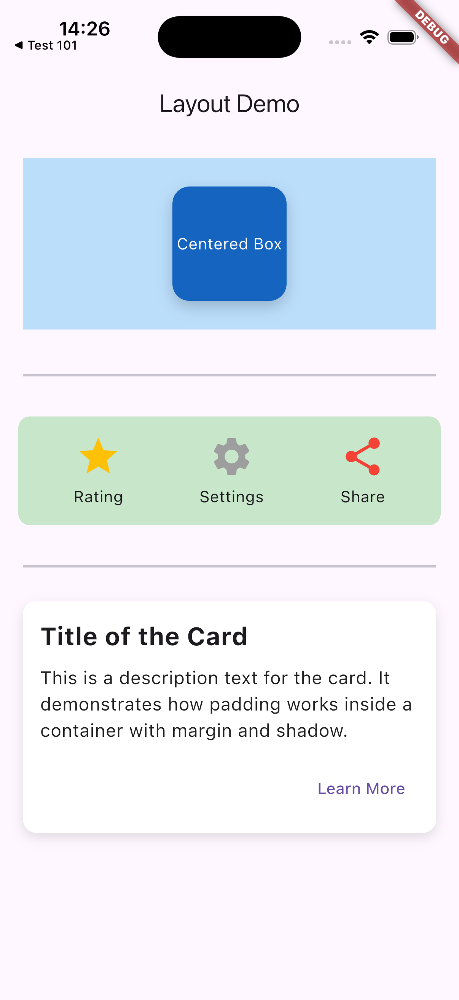

# Workshop: การจัด Layout เบื้องต้น (layout_demo_app)

แอปพลิเคชันสำหรับสาธิตการจัดวาง Layout ใน Flutter โดยใช้ Widget พื้นฐาน 5 ประเภท ได้แก่ `Container`, `Column`, `Row`, `Center`, และ `Padding`

---

## 1. บทบาทและคุณสมบัติหลักของ Layout Widgets

### 1.1 Container
- **บทบาท**: เป็น Widget อเนกประสงค์ที่ทำหน้าที่จัดวาง ตกแต่ง (เช่น สีพื้นหลัง, เส้นขอบ, เงา) และควบคุมขนาด (กว้าง/สูง) ของ Widget ลูก
- **คุณสมบัติหลัก**:
  - `child`: Widget ลูกภายใน Container
  - `width` และ `height`: กำหนดความกว้างและความสูง
  - `padding`: ช่องว่างภายใน Container ระหว่างขอบกับ Widget ลูก
  - `margin`: ช่องว่างภายนอก Container ระหว่างขอบ Container กับ Widget อื่นๆ
  - `color`: สีพื้นหลังของ Container
  - `decoration`: ใช้สำหรับตกแต่งเพิ่มเติม เช่น ใส่เงา (`boxShadow`), ปรับขอบมน (`borderRadius`), หรือใส่ไล่เฉดสี (`gradient`) ผ่าน `BoxDecoration`
  - `alignment`: จัดตำแหน่ง Widget ลูกภายในพื้นที่ของ Container

### 1.2 Column
- **บทบาท**: จัดวาง Widget ลูกหลายๆ ตัวเรียงต่อกันใน **แนวตั้ง (Vertical)**
- **คุณสมบัติหลัก**:
  - `children`: รายการ (List) ของ Widget ลูกที่จะจัดวางเรียงตามแนวตั้ง
  - `mainAxisAlignment`: กำหนดการกระจายตัวของ Widget ลูกในแกนหลัก (แนวตั้ง) เช่น `start`, `center`, `end`, `spaceBetween`, `spaceAround`, `spaceEvenly`
  - `crossAxisAlignment`: กำหนดการจัดวางตำแหน่งของ Widget ลูกในแกนรอง (แนวนอน) เช่น `start`, `center`, `end`, `stretch`
  - `mainAxisSize`: ขนาดของ Column ในแกนหลัก โดย `MainAxisSize.max` คือใช้พื้นที่เต็มความสูงของหน้าจอ/parent และ `MainAxisSize.min` คือย่อขนาดลงมาให้เท่ากับขนาดของลูกรวมกัน

### 1.3 Row
- **บทบาท**: จัดวาง Widget ลูกหลายๆ ตัวเรียงต่อกันใน **แนวนอน (Horizontal)**
- **คุณสมบัติหลัก**:
  - `children`: รายการ (List) ของ Widget ลูกที่จะจัดวางเรียงตามแนวนอน
  - `mainAxisAlignment`: กำหนดการกระจายตัว of Widget ลูกในแกนหลัก (แนวนอน) เช่น `start`, `center`, `end`, `spaceBetween`, `spaceAround`, `spaceEvenly`
  - `crossAxisAlignment`: กำหนดการจัดวางตำแหน่งของ Widget ลูกในแกนรอง (แนวตั้ง) เช่น `start`, `center`, `end`, `stretch`
  - `mainAxisSize`: ขนาดของ Row ในแกนหลัก (`max` หรือ `min`)

### 1.4 Center
- **บทบาท**: จัดตำแหน่ง Widget ลูกให้กึ่งกลางของพื้นที่ที่ parent กำหนดให้ โดย Center จะขยายตัวเต็มพื้นที่ก่อนแล้วจัด Widget ลูกให้อยู่ตรงกลางเสมอ
- **คุณสมบัติหลัก**:
  - `child`: Widget ลูกที่จะถูกจัดให้อยู่ตรงกลาง

### 1.5 Padding
- **บทบาท**: ใช้เพิ่มช่องว่างรอบๆ Widget ลูกตามทิศทางและระยะทางที่กำหนด
- **คุณสมบัติหลัก**:
  - `padding`: กำหนดขนาดของช่องว่าง โดยระบุผ่าน `EdgeInsets` เช่น `EdgeInsets.all()` (ทุกทิศทางเท่ากัน), `EdgeInsets.symmetric()` (แนวตั้ง/แนวนอน), `EdgeInsets.only()` (เฉพาะทิศทางที่ระบุ)
  - `child`: Widget ลูกที่ต้องการเพิ่มช่องว่างภายนอกตัวมันเอง

---

## 2. การประยุกต์ใช้ Widget ในโค้ดตัวอย่าง (How they are used)

ในแอปพลิเคชันนี้แบ่ง Layout ออกเป็น 3 ตัวอย่างหลัก ดังนี้:

### ตัวอย่างที่ 1: การใช้ Container และ Center (Centered Box)
- **การจัด Layout**:
  - ใช้ `Padding` ขนาด 20 เพื่อสร้างระยะห่างระหว่างตัวอย่างนี้กับขอบนอก
  - ใช้ `Container` ชั้นนอกทำหน้าที่เป็นพื้นหลังสีฟ้าอ่อน (`Colors.blue.shade100`) กำหนดความสูงไว้ที่ 150 และความกว้างเต็มจอ (`double.infinity`)
  - ใช้ `Center` ด้านในเพื่อดึงให้ลูกอยู่ออมตาสี่เหลี่ยมกึ่งกลางพอดี
  - ใช้ `Container` ชั้นในสร้างกล่องขนาด $100 \times 100$ ที่ตกแต่งให้เด่นขึ้นด้วยพื้นหลังสีน้ำเงินเข้ม (`Colors.blue.shade800`), ทำขอบมน และใส่ `BoxShadow` เพื่อให้กล่องดูลอยขึ้นมาจากพื้นหลัง
  - สุดท้ายใส่ `Center` อีกชั้นภายในกล่องเล็กเพื่อจัดให้ข้อความ "Centered Box" อยู่ตรงกลาง

### ตัวอย่างที่ 2: การใช้ Row และ Column ร่วมกัน (Action Menu)
- **การจัด Layout**:
  - ใช้ `Container` สีเขียวอ่อน (`Colors.green.shade100`) ขนาดกว้างเต็มหน้าจอ มีขอบมนและ padding ด้านใน 15.0
  - ภายใต้ Container นี้ใช้ `Row` เป็นหลักในการแบ่งพื้นที่ออกเป็น 3 คอลัมน์ทางแนวนอน โดยใช้ `mainAxisAlignment: MainAxisAlignment.spaceAround` เพื่อเฉลี่ยช่องว่างระหว่างแต่ละคอลัมน์ให้เท่ากัน
  - ภายในแต่ละคอลัมน์ใช้ `Column` เพื่อจัดเรียงลูกในแนวตั้ง ประกอบด้วย:
    1. `Icon` (ดาว/ฟันเฟือง/แชร์) ด้านบน
    2. `SizedBox` สูง 5 เพื่อเป็นตัวคั่นระยะ
    3. `Text` (Rating, Settings, Share) ด้านล่าง
  - การจับ Row และ Column มาสวมซ้อนกันทำให้สร้าง UI ที่ดูมีระเบียบและสมมาตรได้ง่ายขึ้น

### ตัวอย่างที่ 3: การใช้ Padding และ Container เพื่อสร้าง Card
- **การจัด Layout**:
  - ใช้ `Container` ที่มีพื้นหลังสีขาวตกแต่งด้วยขอบมนและเงาสีดำจางๆ เพื่อสร้างลักษณะเป็น "การ์ด" (Card) ลอยตัว
  - กำหนดช่องว่างภายนอกการ์ดด้วย `margin` และกำหนดช่องว่างขอบด้านในด้วย `padding` เพื่อไม่ให้ข้อความชิดขอบการ์ดจนเกินไป
  - ใช้ `Column` ด้านในในการวางเนื้อหา 3 ชิ้นในแนวตั้ง:
    1. หัวข้อหลัก (`Text`: Title of the Card) ปรับฟอนต์หนาและขนาดใหญ่ 22
    2. เว้นระยะด้วย `SizedBox` สูง 10
    3. เนื้อหา (`Text` อธิบายฟังก์ชันการทำงานของ Padding)
    4. เว้นระยะด้วย `SizedBox` สูง 15
    5. ปุ่มกด (`TextButton`: Learn More) ซึ่งถูกห่อด้วย `Align(alignment: Alignment.bottomRight)` เพื่อบังคับทิศทางให้ตัวปุ่มชิดขอบล่างขวาของการ์ดตามสไตล์แอปพลิเคชันระดับพรีเมียม

---

## 3. สถานการณ์จริงในการใช้งาน (Real-World Use Cases)

| Widget | สถานการณ์ใช้งานในแอปพลิเคชันจริง |
| :--- | :--- |
| **Container** | ใช้ตกแต่งองค์ประกอบ UI เช่น พื้นหลังปุ่ม, แถบเมนูด้านล่าง, ทำพื้นหลังกราเดียนต์ (Gradient), หรือตัดขอบรูปภาพให้เป็นวงกลม |
| **Column** | ใช้จัดหน้าฟอร์มกรอกข้อมูล (เรียงจากบนลงล่าง), รายการแสดงผลสินค้า, หน้าโปรไฟล์ผู้ใช้ที่มีภาพอยู่บนและมีข้อมูลชื่ออยู่ด้านล่าง |
| **Row** | ใช้จัดแถบเมนูด้านล่าง (Bottom Navigation Bar), แถวของข้อมูลโปรไฟล์ (เช่น จำนวนผู้ติดตาม / โพสต์ / กำลังติดตาม), หรือแถบรายการไอเทมในตระกร้าสินค้าที่มีรูปภาพ ชื่อสินค้า และปุ่มบวกลบจำนวนสินค้าเรียงต่อกัน |
| **Center** | ใช้ในหน้า Loading (เพื่อจัดให้ Progress Indicator อยู่ตรงกลางจอพอดี), หน้าจอแจ้งเตือนข้อผิดพลาด (Error Page) หรือใช้จัดข้อความเดี่ยวๆ ให้กึ่งกลางปุ่มกด |
| **Padding** | ใช้ป้องกันไม่ให้เนื้อหาชิดขอบหน้าจอโทรศัพท์มากเกินไป (เช่น เว้นขอบซ้ายขวา 16.0 เสมอตาม Material Design Guideline) หรือใช้เว้นระยะให้กับช่องกรอกรหัสผ่าน |

---

## ภาพหน้าจอผลลัพธ์ (Screenshot)

