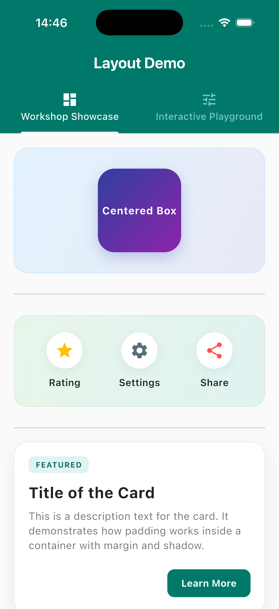
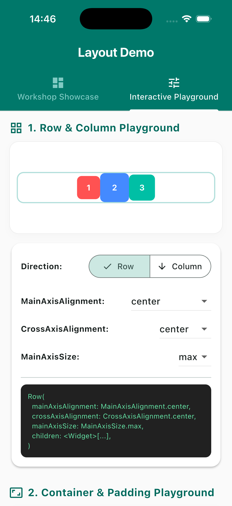

# Workshop: การจัด Layout เบื้องต้น (layout_demo_app)

แอปพลิเคชันสำหรับสาธิตการจัดวาง Layout ใน Flutter โดยใช้ Widget พื้นฐาน 5 ประเภท ได้แก่ `Container`, `Column`, `Row`, `Center`, และ `Padding`

---

## ฟีเจอร์เพิ่มเติมพิเศษ: Interactive Layout Playground 🛠️

แอปพลิเคชันนี้ได้รับการยกระดับให้แบ่งออกเป็น 2 แท็บหลักผ่าน `TabBarView`:

1. **Workshop Showcase**: แสดงผลลัพธ์ของโจทย์ 3 ข้อตามใบงานในดีไซน์ที่หรูหราและทันสมัย (Material 3)
2. **Interactive Playground**: ห้องทดลองจัด Layout แบบตอบสนองทันที (Interactive) เพื่อให้เห็นผลของคุณสมบัติ (Properties) ต่าง ๆ พร้อมแสดงโค้ด Dart แบบ Real-time!

---

## 1. บทบาทและคุณสมบัติหลักของ Layout Widgets

### 1.1 Container

- **บทบาท**: เป็น Widget อเนกประสงค์ที่ทำหน้าที่จัดวาง ตกแต่ง (เช่น สีพื้นหลัง, เส้นขอบ, เงา) และควบคุมขนาด (กว้าง/สูง) ของ Widget ลูก
- **คุณสมบัติหลัก**:
  - `child`: Widget ลูกภายใน Container
  - `width` และ `height`: กำหนดความกว้างและความสูง
  - `padding`: ช่องว่างภายใน Container ระหว่างขอบกับ Widget ลูก
  - `margin`: ช่องว่างภายนอก Container ระหว่างขอบ Container กับ Widget อื่นๆ
  - `color`: สีพื้นหลังของ Container
  - `decoration`: ใช้สำหรับตกแต่งเพิ่มเติม เช่น ใส่เงา (`boxShadow`), ปรับขอบมน (`borderRadius`), หรือใส่ไล่เฉดสี (`gradient`) ผ่าน `BoxDecoration`
  - `alignment`: จัดตำแหน่ง Widget ลูกภายในพื้นที่ของ Container

### 1.2 Column

- **บทบาท**: จัดวาง Widget ลูกหลายๆ ตัวเรียงต่อกันใน **แนวตั้ง (Vertical)**
- **คุณสมบัติหลัก**:
  - `children`: รายการ (List) ของ Widget ลูกที่จะจัดวางเรียงตามแนวตั้ง
  - `mainAxisAlignment`: กำหนดการกระจายตัวของ Widget ลูกในแกนหลัก (แนวตั้ง) เช่น `start`, `center`, `end`, `spaceBetween`, `spaceAround`, `spaceEvenly`
  - `crossAxisAlignment`: กำหนดการจัดวางตำแหน่งของ Widget ลูกในแกนรอง (แนวนอน) เช่น `start`, `center`, `end`, `stretch`
  - `mainAxisSize`: ขนาดของ Column ในแกนหลัก โดย `MainAxisSize.max` คือใช้พื้นที่เต็มความสูงของหน้าจอ/parent และ `MainAxisSize.min` คือย่อขนาดลงมาให้เท่ากับขนาดของลูกรวมกัน

### 1.3 Row

- **บทบาท**: จัดวาง Widget ลูกหลายๆ ตัวเรียงต่อกันใน **แนวนอน (Horizontal)**
- **คุณสมบัติหลัก**:
  - `children`: รายการ (List) ของ Widget ลูกที่จะจัดวางเรียงตามแนวนอน
  - `mainAxisAlignment`: กำหนดการกระจายตัวของ Widget ลูกในแกนหลัก (แนวนอน) เช่น `start`, `center`, `end`, `spaceBetween`, `spaceAround`, `spaceEvenly`
  - `crossAxisAlignment`: กำหนดการจัดวางตำแหน่งของ Widget ลูกในแกนรอง (แนวตั้ง) เช่น `start`, `center`, `end`, `stretch`
  - `mainAxisSize`: ขนาดของ Row ในแกนหลัก (`max` หรือ `min`)

### 1.4 Center

- **บทบาท**: จัดตำแหน่ง Widget ลูกให้กึ่งกลางของพื้นที่ที่ parent กำหนดให้ โดย Center จะขยายตัวเต็มพื้นที่ก่อนแล้วจัด Widget ลูกให้อยู่ตรงกลางเสมอ
- **คุณสมบัติหลัก**:
  - `child`: Widget ลูกที่จะถูกจัดให้อยู่ตรงกลาง

### 1.5 Padding

- **บทบาท**: ใช้เพิ่มช่องว่างรอบๆ Widget ลูกตามทิศทางและระยะทางที่กำหนด
- **คุณสมบัติหลัก**:
  - `padding`: กำหนดขนาดของช่องว่าง โดยระบุผ่าน `EdgeInsets` เช่น `EdgeInsets.all()` (ทุกทิศทางเท่ากัน), `EdgeInsets.symmetric()` (แนวตั้ง/แนวนอน), `EdgeInsets.only()` (เฉพาะทิศทางที่ระบุ)
  - `child`: Widget ลูกที่ต้องการเพิ่มช่องว่างภายนอกตัวมันเอง

---

## 2. การประยุกต์ใช้ Widget ในโค้ดตัวอย่าง (How they are used)

ในแอปพลิเคชันนี้แบ่ง Layout ออกเป็น 3 ตัวอย่างหลักในแท็บ **Workshop Showcase**:

### ตัวอย่างที่ 1: การใช้ Container และ Center (Centered Box)

- **การจัด Layout**:
  - ใช้ `Padding` ขนาด 20 เพื่อสร้างระยะห่างระหว่างตัวอย่างนี้กับขอบนอก
  - ใช้ `Container` ชั้นนอกทำหน้าที่เป็นพื้นหลังสีฟ้าอ่อนไล่เฉดสี กำหนดความกว้างเต็มจอ (`double.infinity`)
  - ใช้ `Center` ด้านในเพื่อดึงให้ลูกอยู่ออมตาสี่เหลี่ยมกึ่งกลางพอดี
  - ใช้ `Container` ชั้นในสร้างกล่องขนาด $120 \times 120$ ที่ตกแต่งด้วย `LinearGradient` สีน้ำเงินเข้มและสีม่วง ปรับขอบมน 24 และใส่ `BoxShadow`
  - สุดท้ายใส่ `Center` อีกชั้นภายในกล่องเล็กเพื่อจัดให้ข้อความ "Centered Box" อยู่ตรงกลาง

### ตัวอย่างที่ 2: การใช้ Row และ Column ร่วมกัน (Action Menu)

- **การจัด Layout**:
  - ใช้ `Container` สีเขียวมิ้นต์อ่อนโยนไล่เฉดสี ขนาดกว้างเต็มหน้าจอ
  - ภายใต้ Container นี้ใช้ `Row` เป็นหลักในการแบ่งพื้นที่ออกเป็น 3 คอลัมน์ทางแนวนอน โดยใช้ `mainAxisAlignment: MainAxisAlignment.spaceAround`
  - ภายในคอลัมน์ใช้ `Column` เพื่อจัดไอคอนวงกลมสีขาวและข้อความฉลากด้านล่าง (Rating, Settings, Share) เรียงกันในแนวตั้งอย่างสมมาตร

### ตัวอย่างที่ 3: การใช้ Padding และ Container เพื่อสร้าง Card

- **การจัด Layout**:
  - ใช้ `Container` สีขาวขอบมน 20 และใส่เงาพื้นหลัง สร้างลักษณะเป็น "การ์ด" (Card) ลอยตัว
  - กำหนดช่องว่างขอบด้านในด้วย `padding` เพื่อเว้นเนื้อหาไม่ให้ชิดขอบการ์ดจนเกินไป
  - ใช้ `Column` ด้านในเพื่อแสดงหัวข้อ, เนื้อหาอธิบาย และใส่ปุ่มกดที่ห่อด้วย `Align(alignment: Alignment.bottomRight)` บังคับตำแหน่งให้อยู่ด้านล่างขวา

---

## 3. รายละเอียดการทำงานของ Interactive Playground 🛠️

ในแท็บ **Interactive Playground** นักศึกษาสามารถทดลองและดูผลลัพธ์ได้ดังนี้:

### 3.1 Row & Column Axis Playground

- **การควบคุม**:
  - เลือกทิศทางระหว่าง **Row** และ **Column**
  - ปรับเปลี่ยนค่า `MainAxisAlignment` เพื่อดูความแตกต่างของการจัดวางองค์ประกอบหลัก
  - ปรับเปลี่ยนค่า `CrossAxisAlignment` เพื่อดูการกระจายตัวในแนวขวาง
  - ปรับค่า `MainAxisSize` ระหว่าง `max` และ `min`
- **การเรียนรู้**: กล่องโค้ดภาษา Dart ด้านล่างจะเจนเนอเรตคำสั่งตามที่คุณเลือกแบบไดนามิกเพื่อให้สามารถนำไปคัดลอกใช้ได้ทันที

### 3.2 Container & Padding Playground

- **การควบคุม**:
  - ปรับสไลเดอร์ค่า `Padding` และ `Margin` (0 ถึง 40) เพื่อเรียนรู้ความแตกต่างระหว่างระยะภายนอกและระยะภายใน
  - เปลี่ยนค่า `Alignment` ของจุดสีเหลืองภายในกล่อง
  - สลับการเปิด/ปิด `BoxDecoration` และทดลองปรับรัศมีขอบมน (`BorderRadius`)
- **การเรียนรู้**: เข้าใจมิติของกล่อง (Box Model) และความสัมพันธ์ของ padding/margin ได้อย่างชัดเจนผ่านแบบจำลองภาพสด

---

## 4. สถานการณ์จริงในการใช้งาน (Real-World Use Cases)

| Widget        | สถานการณ์ใช้งานในแอปพลิเคชันจริง                                                                                                                                                                           |
| :------------ | :--------------------------------------------------------------------------------------------------------------------------------------------------------------------------------------------------------- |
| **Container** | ใช้ตกแต่งองค์ประกอบ UI เช่น พื้นหลังปุ่ม, แถบเมนูด้านล่าง, ทำพื้นหลังกราเดียนต์ (Gradient), หรือตัดขอบรูปภาพให้เป็นวงกลม                                                                                   |
| **Column**    | ใช้จัดหน้าฟอร์มกรอกข้อมูล (เรียงจากบนลงล่าง), รายการแสดงผลสินค้า, หน้าโปรไฟล์ผู้ใช้ที่มีภาพอยู่บนและมีข้อมูลชื่ออยู่ด้านล่าง                                                                               |
| **Row**       | ใช้จัดแถบเมนูด้านล่าง (Bottom Navigation Bar), แถวของข้อมูลโปรไฟล์ (เช่น จำนวนผู้ติดตาม / โพสต์ / กำลังติดตาม), หรือแถบรายการไอเทมในตระกร้าสินค้าที่มีรูปภาพ ชื่อสินค้า และปุ่มบวกลบจำนวนสินค้าเรียงต่อกัน |
| **Center**    | ใช้ในหน้า Loading (เพื่อจัดให้ Progress Indicator อยู่ตรงกลางจอพอดี), หน้าจอแจ้งเตือนข้อผิดพลาด (Error Page) หรือใช้จัดข้อความเดี่ยวๆ ให้กึ่งกลางปุ่มกด                                                    |
| **Padding**   | ใช้ป้องกันไม่ให้เนื้อหาชิดขอบหน้าจอโทรศัพท์มากเกินไป (เช่น เว้นขอบซ้ายขวา 16.0 เสมอตาม Material Design Guideline) หรือใช้เว้นระยะให้กับช่องกรอกรหัสผ่าน                                                    |

---

## ภาพหน้าจอผลลัพธ์ (Screenshot)

