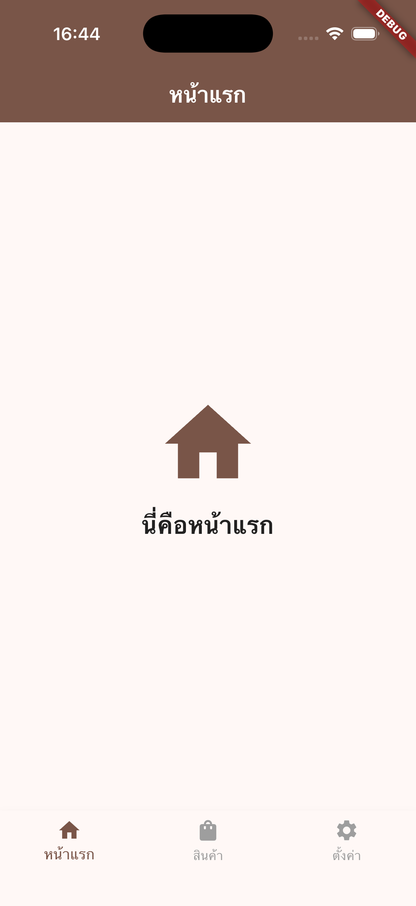
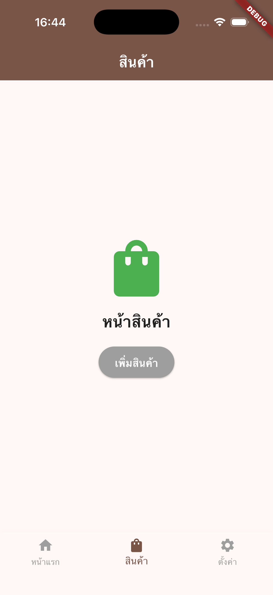
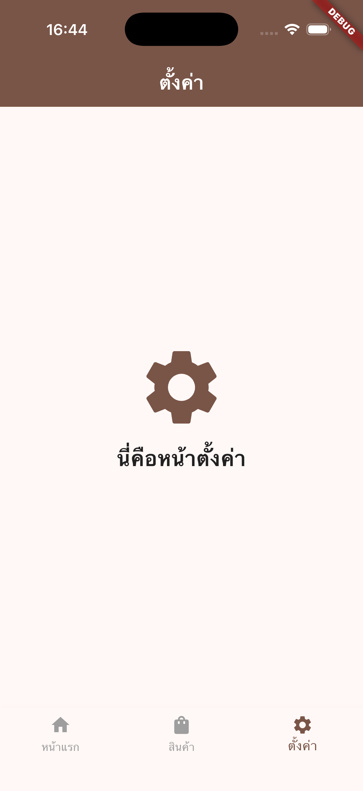

# รายงานผลการทำแบบทดสอบ Flutter Midterm

**รหัสวิชา**: [66-131301] การพัฒนาโปรแกรมประยุกต์บนอุปกรณ์เคลื่อนที่ (Mobile Application Development)  
**หัวข้อสอบ**: การจัดการหน้าจอ (Navigation) ด้วย Bottom Navigation Bar และการใช้งาน Widgets ทั้งแบบมีสถานะและไม่มีสถานะ (Stateless vs. Stateful Widget)

---

## ภาพหน้าจอจำลองตัวแอปพลิเคชัน (Screenshots)

แอปพลิเคชันแบ่งออกเป็น 3 หน้าจอหลักตามปุ่มนำทางด้านล่าง ดังนี้:

|         หน้าแรก (Home)          |         หน้าสินค้า (Products)          |         หน้าตั้งค่า (Settings)          |
| :-----------------------------: | :------------------------------------: | :-------------------------------------: |
|  |  |  |

---

## การรีเซ็ตสถานะและการคงอยู่ของข้อมูลเมื่อสลับหน้าจอ (State Reset Behavior)

### 1. สาเหตุที่สถานะปุ่ม "เพิ่มสินค้า" รีเซ็ตกลับเป็นค่าเริ่มต้น
เมื่อผู้ใช้กดปุ่มเพิ่มสินค้าในหน้าสินค้า (Products) จากนั้นสลับไปยังหน้าแรก (Home) และสลับกลับมายังหน้าสินค้าอีกครั้ง ปุ่มจะรีเซ็ตกลับเป็นสีเทาและแสดงข้อความ "เพิ่มสินค้า" เสมอ เนื่องจากกระบวนการทำงานของ Flutter ดังต่อไปนี้:
* **การถอดออกจากโครงสร้าง Widget Tree**: การสลับหน้าจอด้วยการกำหนดเงื่อนไขเปลี่ยนวิดเจ็ตในส่วนของ Scaffold body ส่งผลให้หน้าจอเดิม (Products) ถูกถอดออกจากโครงสร้างการแสดงผลของแอปพลิเคชันโดยสมบูรณ์
* **การทำลายสถานะ (Dispose)**: เมื่อหน้าจอถูกถอดออกจาก Widget Tree ออบเจกต์ที่ใช้จัดการสถานะ (State Object) รวมถึงตัวแปร `_isAddedToCart` จะถูกทำลายลงเพื่อคืนพื้นที่หน่วยความจำ
* **การสร้างออบเจกต์และกำหนดค่าเริ่มต้นใหม่ (Re-initialization)**: เมื่อสลับหน้าจอกลับมาอีกครั้ง Flutter จะสร้างออบเจกต์สถานะตัวใหม่ขึ้นมาทดสอบ ส่งผลให้ตัวแปร `_isAddedToCart` ถูกกำหนดค่าเริ่มต้นใหม่ให้เป็น `false` เสมอ

### 2. แนวทางการแก้ไขหากต้องการคงสถานะ (State Retention)
หากต้องการรักษาสถานะเดิมไว้ไม่ให้สูญหายเมื่อมีการสลับหน้าจอ สามารถดำเนินการได้ 2 วิธีการ ดังนี้:
1. **การใช้ IndexedStack**: ปรับเปลี่ยนการแสดงผลในหน้าหลักโดยนำ `IndexedStack` มาครอบชุดวิดเจ็ตหน้าจอทั้งหมด แทนการสลับวิดเจ็ตเดี่ยวในตัวแปร body ของ Scaffold วิธีการนี้จะทำการซ่อนหน้าจอที่ไม่ได้เลือกแทนการทำลายทิ้ง ส่งผลให้สถานะภายในยังคงอยู่
2. **การย้ายสถานะขึ้นไปยังระดับที่สูงกว่า (State Lifting)**: ย้ายการจัดเก็บสถานะของตัวแปร `_isAddedToCart` ไปไว้ที่คลาสของหน้าหลัก (`HomePage`) หรือใช้ระบบจัดการสถานะส่วนกลาง (State Management) เพื่อไม่ให้สเตตยึดติดอยู่เฉพาะภายในหน้าสินค้าเพียงอย่างเดียว
