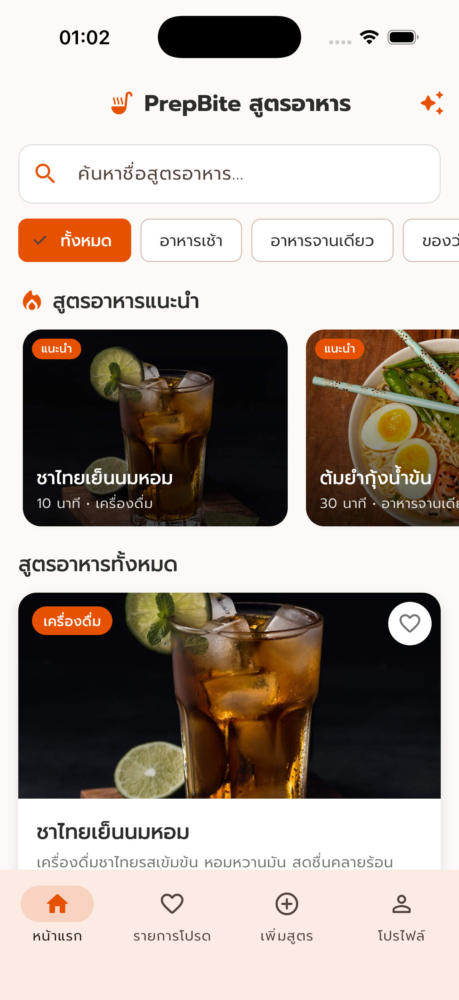
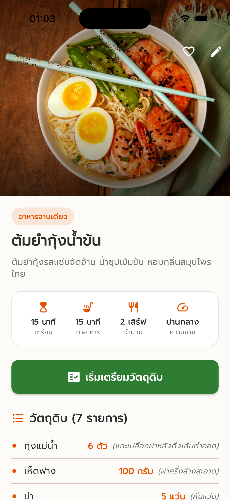
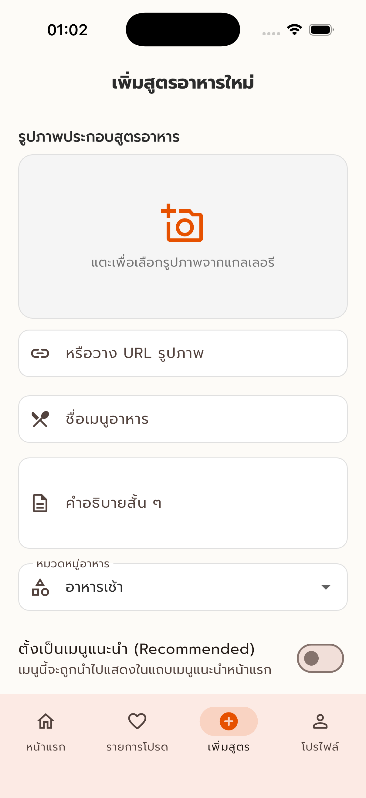
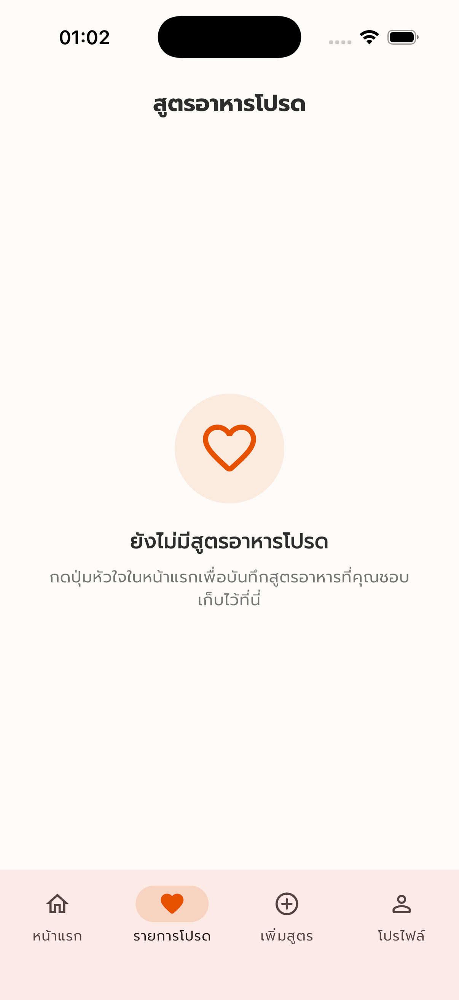
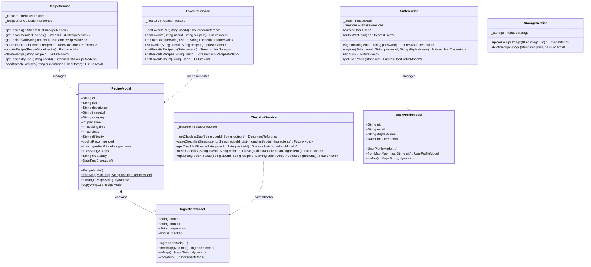
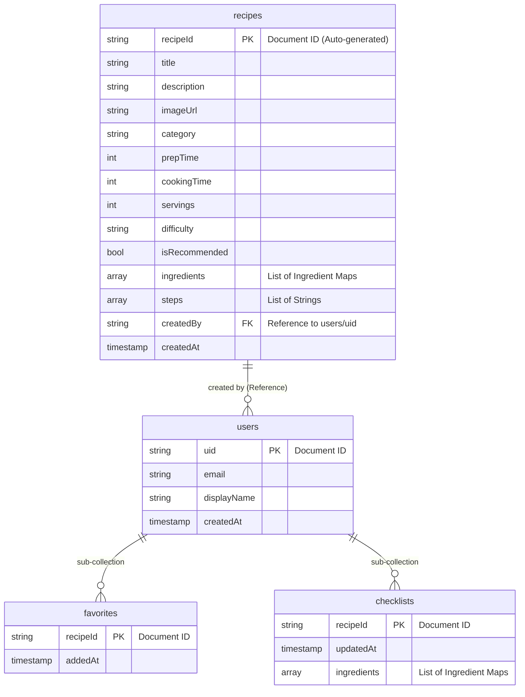

# PrepBite

**PrepBite** คือแอปพลิเคชัน Flutter สำหรับรวบรวมสูตรอาหารง่าย ๆ และช่วยผู้ใช้เตรียมวัตถุดิบด้วยระบบ **Checklist** ก่อนเริ่มทำอาหาร พร้อมการจัดเก็บข้อมูลผ่าน **Firebase** เป็น Backend

---

## ตัวอย่างหน้าจอการทำงาน (Screenshots)

<p align="center">
  
  &nbsp;&nbsp;
  
  &nbsp;&nbsp;
  
  &nbsp;&nbsp;
  
  &nbsp;&nbsp;
  
</p>

---

## เอกสารโครงการและการออกแบบ (Project Designs & Schemas)

### 1. ลิงก์ออกแบบ Figma (Figma Design Link)
สามารถดูรายละเอียดการออกแบบหน้าจอ (UI/UX Design) ได้ที่:
👉 [Figma - PrepBite Design](https://www.figma.com/design/Tr3TDg7ISmkVho6TsN2DX0/prep_bite?node-id=0-1&t=fhF9Xu94EsePhNWk-1)

---

### 2. Class Diagram
Class Diagram แสดงความสัมพันธ์ระหว่าง Data Models และ Services ของแอปพลิเคชัน PrepBite:



---

### 3. โครงสร้างฐานข้อมูลใน Firebase (Firebase Cloud Firestore Structure)
ฐานข้อมูลเก็บข้อมูลในรูปแบบ NoSQL Document Database ซึ่งมีโครงสร้างคอลเลกชันหลัก 2 ส่วนคือ `users` และ `recipes`:



#### รายละเอียดโครงสร้างฟิลด์และชนิดข้อมูล (Database Schema Details)

##### 1. คอลเลกชัน `users` (ข้อมูลผู้ใช้งาน)
* **Path**: `/users/{uid}`
* **รายละเอียด**: เก็บข้อมูลโปรไฟล์พื้นฐานของผู้ใช้งาน โดยเอกสารใช้ ID เดียวกันกับ Firebase Auth UID

| Field Name | Data Type | Description |
| :--- | :--- | :--- |
| `uid` | String | รหัสผู้ใช้งาน (ตรงกับ Auth UID) |
| `email` | String | อีเมลของผู้ใช้งาน |
| `displayName` | String | ชื่อที่แสดงของหน้าโปรไฟล์ |
| `createdAt` | Timestamp | วันเวลาที่ลงทะเบียนสมาชิก |

##### 2. ซับคอลเลกชัน `favorites` (รายการสูตรอาหารที่ถูกใจ)
* **Path**: `/users/{uid}/favorites/{recipeId}`
* **รายละเอียด**: เก็บประวัติการกดถูกใจสูตรอาหาร โดยใช้ ID ของสูตรอาหาร (`recipeId`) เป็นชื่อเอกสาร เพื่อความสะดวกรวดเร็วในการตรวจสอบสถานะแบบ Real-time

| Field Name | Data Type | Description |
| :--- | :--- | :--- |
| `addedAt` | Timestamp | วันเวลาที่กดเพิ่มในรายการโปรด |

##### 3. ซับคอลเลกชัน `checklists` (สถานะการเตรียมวัตถุดิบ)
* **Path**: `/users/{uid}/checklists/{recipeId}`
* **รายละเอียด**: เก็บสถานะการทำ Checklist วัตถุดิบแยกตามสูตรอาหารและผู้ใช้ เพื่อให้สอดคล้องกับการทำงานแบบ Real-time และสามารถกลับมาทำต่อได้

| Field Name | Data Type | Description |
| :--- | :--- | :--- |
| `updatedAt` | Timestamp | วันเวลาที่อัปเดตสถานะ Checklist ล่าสุด |
| `ingredients` | Array (Map) | รายการวัตถุดิบและสถานะการติ๊กเตรียม |

> [!NOTE]
> **โครงสร้างวัตถุดิบใน Map (Ingredient Schema):**
> * `name` (String): ชื่อวัตถุดิบ (เช่น *ข้าวสวย*)
> * `amount` (String): ปริมาณ (เช่น *1 ถ้วย*)
> * `preparation` (String): วิธีเตรียม (เช่น *พักให้เย็น*)
> * `isChecked` (Boolean): สถานะการเลือกเตรียมวัตถุดิบ (`true` / `false`)

##### 4. คอลเลกชัน `recipes` (สูตรอาหารทั้งหมดในระบบ)
* **Path**: `/recipes/{recipeId}`
* **รายละเอียด**: เก็บรายละเอียดและขั้นตอนทั้งหมดของสูตรอาหารที่ถูกป้อนเข้าระบบ

| Field Name | Data Type | Description |
| :--- | :--- | :--- |
| `title` | String | ชื่อเมนูอาหาร |
| `description` | String | คำอธิบายสั้น ๆ ของสูตรอาหาร |
| `imageUrl` | String | URL ลิงก์รูปภาพสูตรอาหาร |
| `category` | String | หมวดหมู่อาหาร (เช่น อาหารเช้า, ของหวาน ฯลฯ) |
| `prepTime` | Number (int) | เวลาที่ใช้ในการเตรียมวัตถุดิบ (นาที) |
| `cookingTime` | Number (int) | เวลาที่ใช้ในการทำอาหาร (นาที) |
| `servings` | Number (int) | จำนวนหน่วยบริโภค / เสิร์ฟ |
| `difficulty` | String | ระดับความยาก (ง่าย, ปานกลาง, ยาก) |
| `isRecommended` | Boolean | สถานะแนะนำในหน้าแรก (`true` / `false`) |
| `ingredients` | Array (Map) | รายการวัตถุดิบทั้งหมด (โครงสร้างเหมือนกับ Checklist) |
| `steps` | Array (String) | รายการขั้นตอนการปรุงตามลำดับ |
| `createdBy` | String | รหัสผ่านผู้สร้างสูตรอาหาร (ตรงกับ `users/{uid}`) |
| `createdAt` | Timestamp | วันเวลาที่สร้างสูตรอาหาร |

---

## ฟีเจอร์หลัก (Features)

### 1. ระบบเข้าสู่ระบบและสมัครสมาชิก (Authentication)
* สมัครสมาชิกและเข้าสู่ระบบด้วย Email และ Password ผ่าน **Firebase Authentication**
* ระบบตรวจสอบสถานะการเข้าสู่ระบบอัตโนมัติด้วย **Auth Wrapper**
* มีระบบ Form Validation ป้องกันข้อมูลผิดพลาด และแสดงข้อความ Error ภาษาไทยที่เข้าใจง่าย

### 2. หน้าแรกและการค้นหาสูตรอาหาร (Home Screen & Search)
* แสดงรายการสูตรอาหารด้วย `ListView.builder` และ `RecipeCard`
* กรองสูตรอาหารตามหมวดหมู่: **อาหารเช้า**, **อาหารจานเดียว**, **ของว่าง**, **ของหวาน**, **เครื่องดื่ม**
* ช่องค้นหาสูตรอาหารแบบ Real-time ตามชื่อเมนู
* ปุ่ม Seed Sample Recipes สร้างสูตรอาหารตัวอย่าง 5 เมนูพร้อมใช้งาน


### 3. หน้ารายละเอียดสูตรอาหาร (Recipe Detail Screen)
* แสดงรูปอาหารขนาดใหญ่, ชื่อเมนู, คำอธิบาย, เวลาเตรียม, เวลาทำอาหาร, จำนวนเสิร์ฟ และระดับความยาก
* รายการวัตถุดิบและขั้นตอนการทำอาหารแยกตามลำดับอย่างชัดเจน
* ปุ่ม **"เริ่มเตรียมวัตถุดิบ"** เพื่อเข้าสู่หน้า Checklist


### 4. ระบบ Checklist เตรียมวัตถุดิบ (Preparation Checklist Screen)
* Checkbox สำหรับติ๊กเลือกวัตถุดิบที่เตรียมเสร็จแล้ว
* **Progress Indicator** แสดงเปอร์เซ็นต์และข้อความ เช่น *"เตรียมแล้ว 4 จาก 6 รายการ"*
* ปุ่ม **"เลือกทั้งหมด"** และ **"ล้าง Checklist"**
* ปุ่ม **"พร้อมเริ่มทำอาหาร"** พร้อมแสดง Dialog แจ้งเตือนเมื่อเตรียมวัตถุดิบครบทุกข้อ
* บันทึกสถานะ Checklist ลงใน **Cloud Firestore** แยกตามผู้ใช้และสูตรอาหาร

### 5. เพิ่มและแก้ไขสูตรอาหาร (Add & Edit Recipe Screen)
* เพิ่มสูตรอาหารใหม่พร้อมอัปโหลดรูปภาพขึ้น **Firebase Storage** หรือใส่ URL รูปภาพ
* เพิ่ม/ลบ รายการวัตถุดิบแบบ Dynamic (ชื่อ, ปริมาณ, วิธีเตรียม)
* เพิ่ม/ลบ ขั้นตอนการทำอาหารแบบ Dynamic
* สิทธิ์การแก้ไขและลบสูตรอาหารเฉพาะผู้ที่เป็นเจ้าของสูตร


### 6. สูตรอาหารโปรด (Favorite Screen)
* บันทึกสูตรอาหารที่ชอบลงในรายการโปรด
* บันทึกข้อมูลแยกตาม Firebase User ID
* สามารถกดเพิ่มหรือยกเลิก Favorite ได้แบบ Real-time


### 7. หน้าโปรไฟล์ผู้ใช้ (Profile Screen)
* แสดงข้อมูลผู้ใช้งาน (Email, Display Name, User ID)
* สรุปสถิติจำนวนสูตรอาหารที่ผู้ใช้เพิ่มเข้าสู่ระบบ และจำนวนสูตรอาหารที่ถูกใจ
* ปุ่มออกจากระบบ (Logout)


---

## เทคโนโลยีที่ใช้ (Tech Stack)

* **Framework**: Flutter (Dart)
* **Design System**: Material 3 (ธีมโทนส้มและเขียวอบอุ่น ยืดหยุ่น รองรับหน้าจอหลายขนาด)
* **Backend**:
  * **Firebase Authentication** (ระบบผู้ใช้งาน)
  * **Cloud Firestore** (ฐานข้อมูล NoSQL แบบ Real-time)
  * **Firebase Storage** (พื้นที่เก็บรูปภาพสูตรอาหาร)
* **Key Packages**:
  * `firebase_core`, `firebase_auth`, `cloud_firestore`, `firebase_storage`
  * `flutter_dotenv` (จัดการ Environment Variables)
  * `cached_network_image` (แสดงและแคชรูปภาพจาก URL)
  * `google_fonts` (ฟอนต์ภาษาไทย Prompt)
  * `image_picker` (เลือกรูปภาพจากแกลเลอรี)

---

## โครงสร้างโปรเจกต์ (Project Structure)

```text
lib/
├── main.dart                      # จุดเริ่มต้นของแอปและโหลด Environment
├── firebase_options.dart          # ค่าคอนฟิก Firebase อ่านจาก .env
├── models/                        # Data Models
│   ├── recipe_model.dart          # โมเดลสูตรอาหาร
│   ├── ingredient_model.dart      # โมเดลวัตถุดิบ
│   └── user_profile_model.dart    # โมเดลโปรไฟล์ผู้ใช้
├── services/                      # Backend Business Logic
│   ├── auth_service.dart          # จัดการ Authentication
│   ├── recipe_service.dart        # จัดการ CRUD สูตรอาหาร
│   ├── favorite_service.dart      # จัดการรายการโปรด
│   ├── checklist_service.dart     # จัดการ Checklist วัตถุดิบ
│   └── storage_service.dart       # จัดการอัปโหลดรูปภาพ
├── screens/                       # หน้าจอแอปพลิเคชัน
│   ├── auth/                      # Login, Register, AuthWrapper
│   ├── home/                      # Home, RecipeDetail
│   ├── checklist/                 # PreparationChecklist
│   ├── recipe/                    # AddRecipe, EditRecipe
│   ├── favorites/                 # FavoriteScreen
│   ├── profile/                   # ProfileScreen
│   └── navigation/                # MainNavigation (BottomNavigationBar)
├── widgets/                       # Reusable UI Widgets
│   ├── recipe_card.dart
│   ├── ingredient_check_tile.dart
│   ├── custom_text_field.dart
│   ├── empty_state_widget.dart
│   ├── loading_widget.dart
│   └── error_widget.dart
└── utils/                         # Utilities & Theme
    ├── validators.dart            # Form Validators
    ├── constants.dart             # ค่าคงที่หมวดหมู่และคอลเลกชัน
    └── app_theme.dart             # ธีมแอปพลิเคชัน Material 3
```

---

## ขั้นตอนการตั้งค่าและการรันโปรเจกต์ (Getting Started)

### 1. ความต้องการของระบบ (Prerequisites)
* Flutter SDK (เวอร์ชัน 3.12 ขึ้นไป)
* Dart SDK
* บัญชี Firebase Console

### 2. การสร้างไฟล์ Environment (`.env`)
สร้างไฟล์ `.env` ที่โฟลเดอร์หลักของโปรเจกต์ (Root Directory) โดยใส่ค่าคอนฟิกจาก Firebase Console:

```env
# Firebase Configuration
FIREBASE_PROJECT_ID=your-firebase-project-id
FIREBASE_STORAGE_BUCKET=your-project.firebasestorage.app
FIREBASE_MESSAGING_SENDER_ID=your-sender-id

# Android Configuration
FIREBASE_ANDROID_API_KEY=your-android-api-key
FIREBASE_ANDROID_APP_ID=your-android-app-id

# iOS Configuration
FIREBASE_IOS_API_KEY=your-ios-api-key
FIREBASE_IOS_APP_ID=your-ios-app-id
FIREBASE_IOS_BUNDLE_ID=com.example.prepBite
```

*(ดูตัวอย่างโครงสร้างได้ในไฟล์ `.env.example`)*

### 3. การติดตั้ง Dependencies
เปิด Terminal แล้วรันคำสั่ง:

```bash
flutter pub get
```

### 4. การรันแอปพลิเคชัน

```bash
flutter run
```

---

## Firestore Security Rules (ตัวอย่างการตั้งค่าสิทธิ์)

```javascript
rules_version = '2';
service cloud.firestore {
  match /databases/{database}/documents {
    function isSignedIn() { return request.auth != null; }
    function isOwner(userId) { return isSignedIn() && request.auth.uid == userId; }

    match /users/{userId} {
      allow read, write: if isOwner(userId);
      match /favorites/{recipeId} { allow read, write: if isOwner(userId); }
      match /checklists/{recipeId} { allow read, write: if isOwner(userId); }
    }

    match /recipes/{recipeId} {
      allow read: if true;
      allow create: if isSignedIn();
      allow update, delete: if isSignedIn() && resource.data.createdBy == request.auth.uid;
    }
  }
}
```
