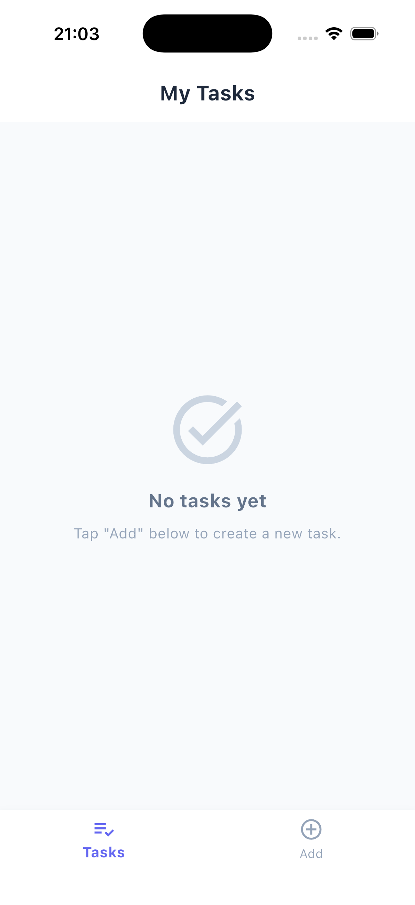
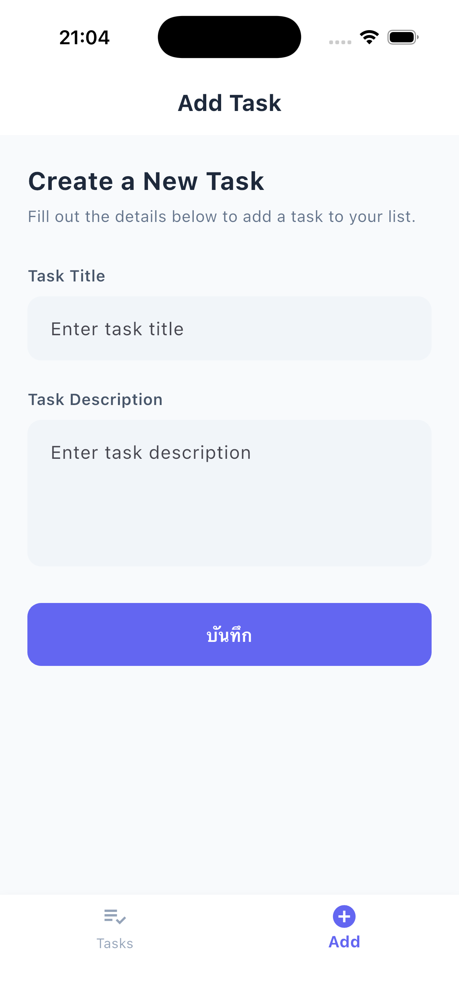
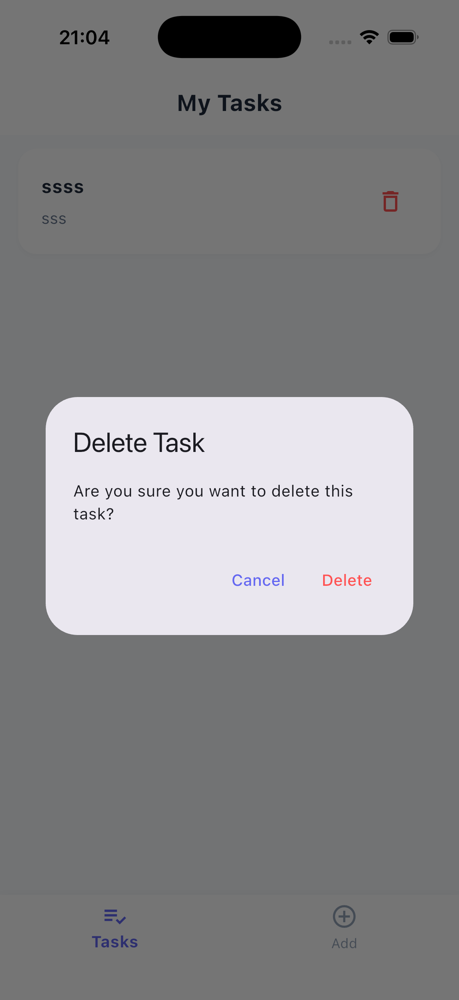

# Task Tracker App (To-Do List)

**Task Tracker App** คือแอปพลิเคชันสำหรับบันทึกและจัดการรายการงาน (To-Do List) ที่พัฒนาด้วย **Flutter** ร่วมกับ **Firebase Cloud Firestore** เป็นระบบหลังบ้าน มีระบบ Bottom Navigation Bar สลับหน้าจอ มีการตรวจสอบความถูกต้องของข้อมูล (Form Validation) และมีระบบ Unit Test ครอบคลุมการทำงาน

---

## ตัวอย่างหน้าจอการทำงาน (Screenshots)

<p align="center">
  
  &nbsp;&nbsp;&nbsp;&nbsp;
  
  &nbsp;&nbsp;&nbsp;&nbsp;
  
</p>

| หน้าจอหลัก (Tasks List) | หน้าจอเพิ่มรายการงาน (Add Task) | ยืนยันการลบรายการงาน (Delete Task) |
| :---: | :---: | :---: |
| แสดงรายการงานทั้งหมดจาก Firestore แบบเรียลไทม์ | แบบฟอร์มเพิ่มงานพร้อม Validation ตรวจสอบข้อมูล | ป๊อปอัปยืนยันก่อนลบรายการงานออกจากฐานข้อมูล |

---

## ฟีเจอร์หลัก (Key Features)

1. **Bottom Navigation Bar & Screen Management:**
   - ใช้ `Scaffold` และ `IndexedStack` ในการสลับหน้าจอระหว่าง **Tasks** (ดูรายการงานทั้งหมด) และ **Add** (เพิ่มรายการงานใหม่)
2. **Firebase Cloud Firestore Integration:**
   - บันทึกชื่อรายการงาน (`title`) และรายละเอียด (`description`) ลงในคอลเลกชัน `tasks` บน Firestore
   - ดึงข้อมูลมาแสดงผลในรูปแบบ `ListView` / `ListTile` แบบเรียลไทม์ผ่าน `StreamBuilder`
3. **Data Validation:**
   - มีระบบตรวจสอบความถูกต้องของข้อมูลในแบบฟอร์มเพิ่มรายการงาน
   - `Title` และ `Description` ต้องไม่เป็นค่าว่าง (NotEmpty)
   - หากผู้ใช้ลืมกรอกข้อมูล ระบบจะแสดงข้อความแจ้งเตือนสีแดงใต้ `TextField` แต่ละช่องทันที
4. **Unit Testing:**
   - มีคลาส `ValidationService` สำหรับตรวจสอบความถูกต้องของข้อความ (`isValidString`)
   - มีไฟล์ Unit Test `validation_service_test.dart` ครอบคลุมการทดสอบข้อความที่ถูกต้องและข้อความที่ไม่ถูกต้อง (Empty / Null)

---

## โครงสร้างโปรเจกต์ (Project Structure)

```
todo_list_app/
├── android/                   # ไฟล์คอนฟิกฝั่ง Android Native
├── ios/                       # ไฟล์คอนฟิกฝั่ง iOS Native
├── media/                     # รูปภาพตัวอย่างหน้าจอแอปพลิเคชัน (Screenshots)
│   ├── home.png
│   ├── add.png
│   └── delete.png
├── lib/
│   ├── main.dart              # จุดเริ่มต้นแอปพลิเคชันและการตั้งค่า Theme
│   ├── validation_service.dart # คลาสตรวจสอบความถูกต้องของข้อมูล (Validation Service)
│   ├── firebase_options.dart  # ไฟล์คอนฟิกเชื่อมต่อ Firebase (อ่านจาก .env)
│   ├── models/
│   │   └── task_model.dart    # Data Model สำหรับแปลงข้อมูล Firestore Document
│   ├── widgets/
│   │   └── task_card.dart     # Custom ListTile/Card Widget แสดงผลรายการงาน
│   └── screens/
│       ├── main_screen.dart   # หน้าจอหลักที่ควบคุม BottomNavigationBar และ IndexedStack
│       ├── tasks_screen.dart  # หน้าจอแสดงรายการงานทั้งหมด (StreamBuilder)
│       └── add_screen.dart    # หน้าจอแบบฟอร์มเพิ่มรายการงานใหม่
├── test/
│   ├── validation_service_test.dart # Unit Test ตรวจสอบคลาส ValidationService
│   └── widget_test.dart       # Widget Test Placeholder
├── .env                       # ไฟล์เก็บค่า Environment Variables (API Keys)
├── .env.example               # ไฟล์ตัวอย่างคีย์สำหรับการติดตั้ง
└── pubspec.yaml               # ไฟล์จัดการ Dependencies และ Assets
```

---

## เทคโนโลยีที่ใช้ (Tech Stack & Dependencies)

- **Framework:** Flutter (Dart SDK ^3.12.2)
- **Database:** Firebase Cloud Firestore (`cloud_firestore: ^6.7.1`)
- **Backend Core:** Firebase Core (`firebase_core: ^4.12.1`)
- **Environment Management:** Flutter Dotenv (`flutter_dotenv: ^5.2.1`)
- **Testing:** `flutter_test`

---

## ขั้นตอนการติดตั้งและการรันแอปพลิเคชัน (Getting Started)

### 1. Clone หรือเปิดโปรเจกต์
```bash
cd todo_list_app
```

### 2. ติดตั้ง Dependencies
```bash
flutter pub get
```

### 3. ตั้งค่า Environment Variables (`.env`)
คัดลอกไฟล์ `.env.example` เป็น `.env` และกรอกค่าคีย์ Firebase ของคุณ:
```env
FIREBASE_PROJECT_ID=your_project_id
FIREBASE_STORAGE_BUCKET=your_storage_bucket
FIREBASE_MESSAGING_SENDER_ID=your_messaging_id
FIREBASE_ANDROID_API_KEY=your_android_api_key
FIREBASE_ANDROID_APP_ID=your_android_app_id
FIREBASE_IOS_API_KEY=your_ios_api_key
FIREBASE_IOS_APP_ID=your_ios_app_id
FIREBASE_IOS_BUNDLE_ID=com.example.todoListApp
```

### 4. รันการทดสอบ Unit Tests
```bash
flutter test test/validation_service_test.dart
```

### 5. รันแอปพลิเคชัน
```bash
# รันบน Simulator / Device
flutter run
```
