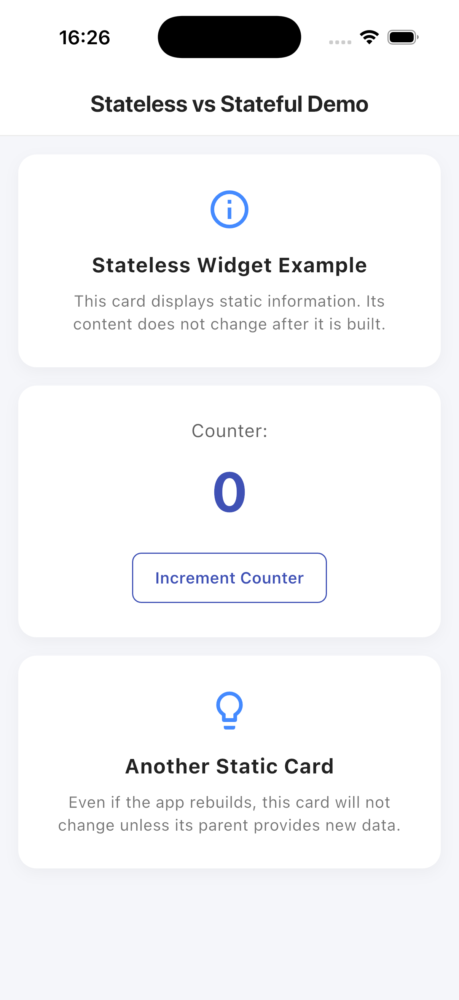

# Workshop: ความแตกต่างระหว่าง StatelessWidget และ StatefulWidget ใน Flutter

---

## 1. ความแตกต่างระหว่าง StatelessWidget และ StatefulWidget (เชิงทฤษฎีและโค้ดตัวอย่าง)

### 1.1 คำอธิบายเชิงทฤษฎี

- **StatelessWidget (เน้นการแสดงผลคงที่ / ปรับเปลี่ยนค่าไม่ได้)**:
  - มีลักษณะการทำงานเพื่อแสดงผลข้อมูลเท่านั้น โครงสร้างและสถานะภายในตัววิดเจ็ตจะไม่สามารถปรับเปลี่ยนค่าได้ตลอดระยะเวลาที่แสดงผลบนหน้าจอ
  - กรณีที่ต้องการปรับเปลี่ยนการแสดงผล จะต้องอาศัยวิดเจ็ตหลัก (Parent Widget) ในการสร้างวิดเจ็ตใหม่ (Rebuild) และส่งผ่านค่าชุดใหม่มาทาง Constructor
  - ไม่มีการใช้งานเมธอด `setState()` เพื่อสั่งอัปเดตหน้าจอด้วยตนเอง
- **StatefulWidget (ตอบสนองการปฏิสัมพันธ์ / ปรับเปลี่ยนค่าตามสถานะ)**:
  - มีคุณสมบัติในการจัดเก็บและปรับปรุงสถานะ (State) ภายในตัวเองได้ตลอดอายุการใช้งาน เพื่อตอบสนองต่อการปฏิสัมพันธ์ของผู้ใช้งานหรือเหตุการณ์ภายนอก เช่น การป้อนข้อความ หรือการเลือกตัวเลือกต่างๆ
  - โครงสร้างการพัฒนาจะแบ่งออกเป็น 2 ส่วนหลัก ได้แก่:
    1.  **StatefulWidget Class**: โครงร่างวิดเจ็ตภายนอกที่เป็นรูปแบบคงที่ (Immutable)
    2.  **State Class**: พื้นที่จัดเก็บตัวแปร ข้อมูล และตรรกะที่สามารถปรับปรุงแก้ไขค่าได้ (Mutable) พร้อมทำหน้าที่เรียกเมธอด `setState()` เพื่อสั่งปรับปรุงหน้าจอแสดงผล

### 1.2 ตัวอย่างโค้ดในโปรเจกต์นี้

- **ตัวอย่าง StatelessWidget**: [StatelessInfoCard](file:///Users/chilgoe/Documents/2026/ncu-mobile-app/widget_stl_stf/lib/widgets/stateless_info_card.dart)

  ```dart
  class StatelessInfoCard extends StatelessWidget {
    final IconData icon;
    final String title;
    final String description;

    const StatelessInfoCard({
      super.key,
      required this.icon,
      required this.title,
      required this.description,
    });

    @override
    Widget build(BuildContext context) {
      return Container(
        child: Column(
          children: [
            Icon(icon),
            Text(title),
            Text(description),
          ],
        ),
      );
    }
  }
  ```

  _คำอธิบายโค้ด: `StatelessInfoCard` ทำหน้าที่รับค่าเพื่อนำมาแสดงผลเพียงอย่างเดียว ไม่มีเมธอดหรือการทำงานที่จะแก้ไขสถานะข้อมูลภายในตัวเองได้ หากวิดเจ็ตหลักที่เป็น Parent ไม่สั่งประมวลผลสร้างใหม่ (Rebuild) ข้อมูลของการ์ดนี้จะคงเดิมเสมอ_

- **ตัวอย่าง StatefulWidget**: [StatefulCounterCard](file:///Users/chilgoe/Documents/2026/ncu-mobile-app/widget_stl_stf/lib/widgets/stateful_counter_card.dart)

  ```dart
  class StatefulCounterCard extends StatefulWidget {
    const StatefulCounterCard({super.key});

    @override
    State<StatefulCounterCard> createState() => _StatefulCounterCardState();
  }

  class _StatefulCounterCardState extends State<StatefulCounterCard> {
    int _counter = 0; // ประกาศตัวแปรเก็บสถานะการนับจำนวน

    void _handleIncrement() {
      setState(() {
        _counter++; // เพิ่มค่าสะสมและส่งสัญญาณแจ้งเตือนระบบเพื่อวาดหน้าจอใหม่
      });
    }

    @override
    Widget build(BuildContext context) {
      return Container(
        child: Column(
          children: [
            Text('$_counter'), // แสดงผลตัวเลขตามสถานะล่าสุด
            OutlinedButton(
              onPressed: _handleIncrement,
              child: const Text('Increment Counter'),
            ),
          ],
        ),
      );
    }
  }
  ```

  _คำอธิบายโค้ด: `StatefulCounterCard` สามารถคำนวณและเพิ่มค่าตัวเลขได้ เนื่องจากจัดเก็บตัวแปร `_counter` ไว้ภายใน State Class เมื่อผู้ใช้กดปุ่ม ระบบจะเรียกทำงานผ่านเมธอด `_handleIncrement()` เพื่อปรับค่าตัวแปรให้เพิ่มขึ้นพร้อมใช้คำสั่ง `setState()` สั่งรีบิลด์และอัปเดตเฉพาะพื้นที่ของวิดเจ็ตส่วนนี้โดยทันที_

---

## 2. บทบาทสำคัญของเมธอด `setState()` ใน StatefulWidget

เมธอด **`setState(VoidCallback fn)`** ทำหน้าที่เปรียบเสมือนกลไกในการอัปเดตส่วนติดต่อผู้ใช้ (UI Update) เฉพาะบริเวณที่มีการเปลี่ยนแปลงสถานะข้อมูล โดยมีขั้นตอนดังต่อไปนี้:

1.  **แจ้งเตือนการเปลี่ยนแปลงสถานะ (Mark as Dirty)**: เมื่อเกิดการอัปเดตค่าตัวแปรภายในแอปพลิเคชัน Flutter จะยังไม่มีการอัปเดตหน้าจอในทันที การเรียกใช้งานเมธอด `setState()` จะเป็นการส่งสัญญาณแจ้งระบบว่าสถานะภายในเปลี่ยนแปลงแล้วและจำเป็นต้องสร้างใหม่
2.  **ประมวลผลสร้างโครงร่างวิดเจ็ตใหม่ (Rebuild)**: ระบบจะกลับไปเรียกใช้งานเมธอด `build()` ของวิดเจ็ตชิ้นนั้นอีกครั้ง เพื่อนำค่าล่าสุดของตัวแปรมาประมวลผลเป็นโครงสร้าง UI ชุดใหม่
3.  **ปรับปรุงการแสดงผลล่าสุด (UI Refresh)**: หน้าจอจะดำเนินการวาดใหม่เพื่อแสดงผลข้อมูลที่เป็นปัจจุบันให้แก่ผู้ใช้งาน โดยไม่ส่งผลกระทบหรือรบกวนประสิทธิภาพการแสดงผลของวิดเจ็ตส่วนอื่นๆ ที่ไม่มีความเกี่ยวข้อง

> [!IMPORTANT]
> หากปรับเปลี่ยนค่าตัวแปร (เช่น เขียนชุดคำสั่ง `_counter++`) โดยไม่มีการทำงานผ่านเมธอด `setState()` ค่าข้อมูลภายในระบบจะถูกปรับเปลี่ยนจริงในหน่วยความจำหลัก แต่หน้าจอส่วนติดต่อผู้ใช้จะไม่เกิดการเปลี่ยนแปลงใดๆ เนื่องจากไม่มีการแจ้งเตือนระบบให้ทำการอัปเดตการแสดงผล

---

## 3. สถานการณ์จริงในการเลือกใช้งานวิดเจ็ตแต่ละประเภท

### 3.1 สถานการณ์ที่เหมาะสมกับการใช้งาน StatelessWidget

1.  **หน้าแสดงรายละเอียดคงที่ (Static Information / About Us / Privacy Policy)**: หน้าจอการแสดงผลข้อมูลที่ไม่จำเป็นต้องอัปเดตตามเวลาจริง เช่น หน้าประวัติองค์กร หน้าข้อตกลงการใช้งาน หรือหน้านโยบายความเป็นส่วนตัว
2.  **ส่วนประกอบ UI มาตรฐานที่นำกลับมาใช้ใหม่ (Reusable UI Components)**: ตัวอย่างเช่น ปุ่มสั่งการมาตรฐาน (Custom Button) หรือป้ายแสดงสถานะ (Tag/Badge) ที่รับค่าพารามิเตอร์เข้ามาแสดงสีและข้อความตามเงื่อนไข โดยไม่มีโครงสร้างตรรกะสะสมข้อมูลภายในตัวเอง

### 3.2 สถานการณ์ที่เหมาะสมกับการใช้งาน StatefulWidget

1.  **ช่องค้นหาข้อมูลแบบตอบสนองทันที (Live Search / Auto-Complete)**: ช่องป้อนข้อมูลที่เมื่อผู้ใช้กรอกข้อความลงไปแล้ว ระบบจะต้องดำเนินการกรองผลลัพธ์หรือแนะนำคำค้นหาที่สอดรับกับตัวอักษรปัจจุบันบนหน้าจอโดยทันที
2.  **ระบบจัดการตะกร้าสินค้า (Shopping Cart System)**: ส่วนจัดการรายการสินค้าที่อนุญาตให้ผู้ใช้เพิ่ม ลดปริมาณ หรือทำเครื่องหมายเลือกรายการสินค้าที่จะดำเนินการชำระเงิน โดยราคารวมและข้อมูลจะปรับเปลี่ยนตามกิจกรรมของผู้ใช้งานจริง

---

## 4. ภาพหน้าจอแอปพลิเคชัน (Application Screenshot)


